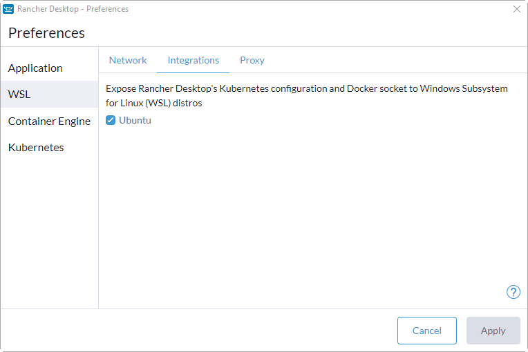
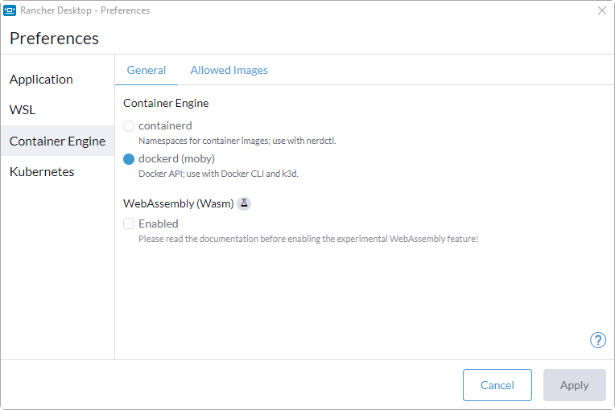

## Prerequisites

### If working on windows

1. [WSL](https://learn.microsoft.com/en-us/windows/wsl/install)
2. [Rancher Desktop](https://rancherdesktop.io/)
   - WSL Integration should be set to whatever WSL distro you have installed
     
   - Container engine should be dockerd(moby)
     
3. [poetry](https://python-poetry.org/docs/#installation)

### If working on LINUX

1. Install docker ce

## How to get started?

1. Download or clone the project
2. Run the following command to setup the project using poetry

```
poetry install
```

3. Run the following command to get the framework up and running

```
streamlit_mpa_template
```

4. [Open the app](http://localhost:8000)

```
http://localhost:8000
```
